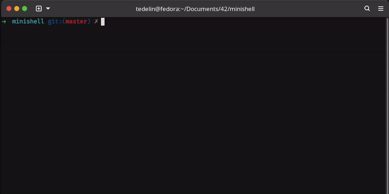

# Minishell ⚙️

## Description

Minishell is a simple shell implementation in C. It is a project of the 42 school cursus.

## Features

Reimplemented the following features:

- Pipes (|)
- Signals (Ctrl-C, Ctrl-D, Ctrl-\)
- Redirection (>, <, >>, <<)
- Environment variables with expansion
- Builtins functions:
  - export
  - unset
  - cd
  - echo
  - env
  - pwd
  - exit

## Installation

```bash
git clone git@github.com:tedelin/minishell.git
cd minishell
make
```

## Usage

```bash
./minishell
```

## Preview


